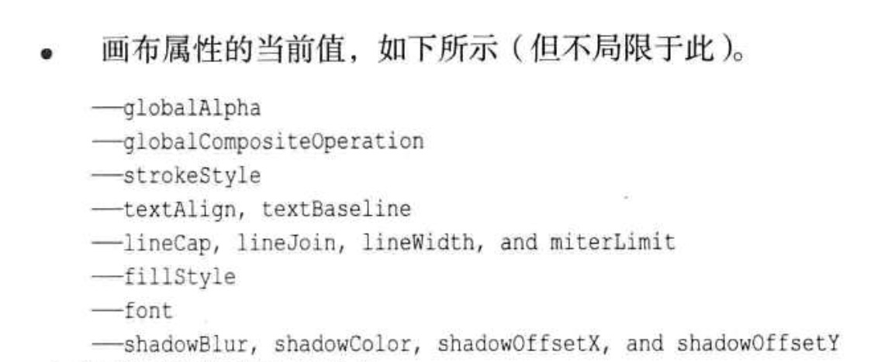

### canvas

#### canvas基础

绘图、着色、基本二维形状变化

绘图堆栈状态。每个状态随时存储canvas上下文数据

当前路径和当前位图受Canvas环境控制，不属于保存的状态。

#### canvas模式

画图的基础是根据全局设置的样式出发。

#### 路径

路径就是一系列点以及这些点直接的连线。

### 缩放、旋转、位移

setTransform 

x1 = ax + cy + e
y1 = bx + dy + f

### 清除画布的方法

1.用新的背景填充整个画布
2.重置画布的宽高
3.调用clearRect函数

### 检测一个点是否在当前路径上

### 字体基线对齐（p84）

### 通过canvas进行像素操作
    