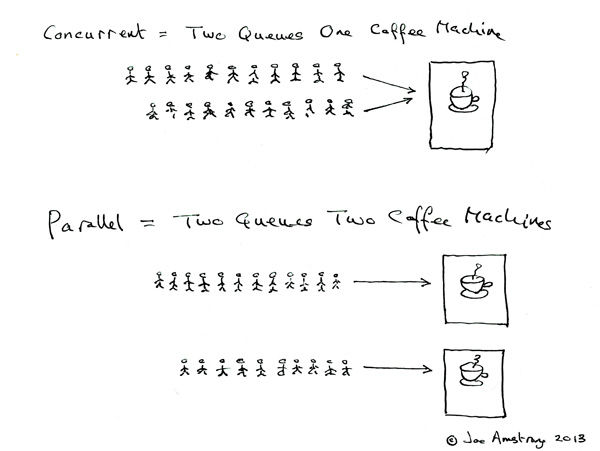

### 同步和异步

UNIX® Network Programming Volume 1, Third Edition: The Sockets Networking

同步和异步关注的是消息通信机制。

同步是在发出一个调用时，在没有得到结果之前，该 **调用**就不会返回，但是一旦调用返回，就得到返回值。

异步是当一个异步过程调用发出后，调用者不会立刻得到结果。而是在*调用*发出后，被调用者通过状态、通知来通知调用者，调用者通过回调函数处理这个调用。

### 闭包

当函数脱离所声明的作用域时依然可以访问到该作用域链中的变量。

### 回调函数

在计算机程序设计中，回调函数，或简称回调（Callback 即call then back 被主函数调用运算后会返回主函数），是指通过函数参数传递到其它代码的，某一块可执行代码的引用。这一设计允许了底层代码调用在高层定义的子程序。

### 阻塞与非阻塞

阻塞和非阻塞关注的是程序在等待调用结果（消息，返回值）时的状态.

阻塞调用是指调用结果返回之前，当前线程会被挂起。调用线程只有在得到结果之后才会返回。
非阻塞调用指在不能立即得到结果之前，该调用不会阻塞当前线程。

### 作用域 

在电脑程式设计中，作用域（scope，或译作有效范围）是名字（name）与实体（entity）的绑定（binding）保持有效的那部分计算机程序。不同的编程语言可能有不同的作用域和名字解析。而同一语言内也可能存在多种作用域，随实体的类型变化而不同。作用域类别影响变量的绑定方式，根据语言使用静态作用域还是动态作用域变量的取值可能会有不同的结果。

### 反射机制（wiki）

In computer science, reflection is the ability of a computer program to examine, introspect, and modify its own structure and behavior at runtime

在计算机科学领域，反射是指一类应用，它们能够自描述和自控制。也就是说，这类应用通过采用某种机制来实现对自己行为的描述（self-representation）和监测（examination），并能根据自身行为的状态和结果，调整或修改应用所描述行为的状态和相关的语义。

### 静态作用域与动态作用域

静态作用域又称为词法作用域，采用词法作用域的变量叫做词法变量。词法变量有一个在编译时静态确定的作用域。

动态作用域，采用动态作用域的变量叫做动态变量。只要程序正在执行定义了动态变量的代码段（也就是这代码还在调用栈里），那么在这段时间内，该变量一直存在。

动态eg

```js
    function a() {
      console.log(t);
    }

    function b() {
      var t = 2;
      a();
    }

    var t = 1;
    b();
    // 在静态作用域中 输出1，在动态作用域中输出2；
```

### 耦合性

>耦合性指程序中，模块以及模块之间信息或参数依赖的程度。
耦合指的是模块与模块之间的依赖程度，耦合度指的是两个模块之间的。（也许为了降低两者的耦合度的同时提高了他们与某个模块的依赖程度，这个其实是平衡全局的过程，单单着眼于两个模块或者是一个子集是肤浅的）

#### 内容耦合

>一个模块直接使用另一个模块的内部数据，或通过非正常入口而转入另一个模块内部。此时，被修改的模块完全依赖于修改它的模块。（个人理解：就是修改内部数据的行为（可以认为是函数）不在该模块下，而是在实例化它的模块下）

eg.

```js
  class a {
    c = 1;
  }

  class b {
    t = new a();
    changeT() {
      this.t.c += 1;// 模块b对应的实例中直接修改模块a实例的内部数据。
    }
  }


```


#### 共用耦合/公共耦合

>通过一个公共数据环境互相作用的那些模块间的耦合。公共耦合的复杂程度随耦合模块的个数增加而增加
（个人理解：各个模块的内部数据和一个公共数据环境对接，模块通过修改获取公共数据环境中的数据，相互影响）

```js
  let tot = []; 

  class a {
    t = 0; 
    update() {
      tot.push(1);
    }
  }

  class b {
    update() {
      tot.pop();
    }
  }


```

#### 外部耦合(wiki上的概念和查出来的不一样)

>发生在两个模块共用一个外加的数据格式、通信协议或者设备界面，基本上和模块的外部工具及设备的沟通有关。(外部耦合与公共耦合是相似的,外部耦合访问的全局数据是基本数据项,而不是数据结构。)

#### 控制耦合

>指一个模块调用另一个模块时，传递的是控制变量（如开关、标志等），被调模块通过改控制变量的值有选择地执行块内的一个功能。（被调用模块的方法接收控制变量，控制代码执行）

调用模块需要知道被调用模块的内部逻辑才能正常执行。

```js
  class a {
    b = new b();
    setState(status) {
      this.b.setState(status);
    }
  }

  class b {
    t = null;
    setState(status) {
      if (status == 0) {
        this.t = '0';
      } else if (status == 1) {
        this.t = '1';
      } else if (status == 2) {
        this.t = '2';
      }
    } 
  }

  let c = new a();

```

#### 特征耦合/标记耦合

>也称为数据结构耦合，是指几个模块共享一个复杂的数据结构，如高级语言中的数组名、记录名、文件名等这些名字即标记，其实传递的是这个数据结构的地址。（传递非全局数据结构）


#### 数据耦合/数据耦合

>是指模块借由传入值共享数据，每一个数据都是最基本的数据，而且只分享这些数据（只是传入数据）。
（传递非全局值）

#### 消息耦合

>可以由以下两个方式达成：状态的去中心化，组件间利用传入值或消息传递来通信。

#### 无耦合

>模块完全不和其他模块交换信息。

#### 面向对象

>所谓对象，就是抽象化的数据本身。

>面向对象程序设计（英语：Object-oriented programming，缩写：OOP）是种具有对象概念的程序编程典范，同时也是一种程序开发的抽象方针。它可能包含数据、属性、代码与方法。对象则指的是类的实例。它将对象作为程序的基本单元，将程序和数据封装其中，以提高软件的重用性、灵活性和扩展性，对象里的程序可以访问及经常修改对象相关连的数据。在面向对象程序编程里，计算机程序会被设计成彼此相关的对象[1][2]。
面向对象程序设计可以看作一种在程序中包含各种独立而又互相调用的对象的思想，这与传统的思想刚好相反：传统的程序设计主张将程序看作一系列函数的集合，或者直接就是一系列对电脑下达的指令。面向对象程序设计中的每一个对象都应该能够接受数据、处理数据并将数据传达给其它对象，因此它们都可以被看作一个小型的“机器”，即对象。目前已经被证实的是，面向对象程序设计推广了程序的灵活性和可维护性，并且在大型项目设计中广为应用。此外，支持者声称面向对象程序设计要比以往的做法更加便于学习，因为它能够让人们更简单地设计并维护程序，使得程序更加便于分析、设计、理解。反对者在某些领域对此予以否认。
当我们提到面向对象的时候，它不仅指一种程序设计方法。它更多意义上是一种程序开发方式。在这一方面，我们必须了解更多关于面向对象系统分析和面向对象设计（Object Oriented Design，简称OOD）方面的知识。许多流行的编程语言是面向对象的,它们的风格就是会透由对象来创出实例。

#### 柯里化

>把接受多个参数的函数变换成接受一个单一参数（最初函数的第一个参数）的函数，并且返回接受余下的参数而且返回结果的新函数的技术。

#### 聚集

>聚集(Aggregation)是一种特殊形式的关联。聚集表示类之间的关系是整体与部分的关系。聚集可以进一步划分成共享聚集(Shared Aggregation)和组成。
部分可以参加多个整体,我们称之为共享聚集。
另一种情况是整体拥有各部分,部分与整体共存,如整体不存在了,部分也会随之消失,这称为组成(Composition)。

作者：amalgamation
链接：https://www.zhihu.com/question/19918532/answer/21647195
来源：知乎
著作权归作者所有。商业转载请联系作者获得授权，非商业转载请注明出处。

类型系统的一些概念，众说纷纭，使用上也比较乱。有些东西，甚至不好严格定义。以下算学术界的一种相对“严格”的说法。
1.  先定义一些基础概念
Program Error
strapped errors。导致程序终止执行，如除0，Java中数组越界访问
untrapped errors。出错后继续执行，但可能出现任意行为。如C里的缓冲区溢出、Jump到错误地址
Forbidden Behaviours   语言设计时，可以定义一组forbidden behaviors. 它必须包括所有untrapped errors, 但可能包含trapped errors.
Well behaved、ill behaved
well behaved: 如果程序执行不可能出现forbidden behaviors, 则为well behaved。
ill behaved: 否则为ill behaved...

2. 有了上面的概念，再讨论强、弱类型，静态、动态类型
  
  强、弱类型
  强类型
  strongly typed: 如果一种语言的所有程序都是well behaved——即不可能出现forbidden behaviors，则该语言为strongly typed。
  弱类型
  weakly typed: 否则为weakly typed。比如C语言的缓冲区溢出，属于trapped errors，即属于forbidden behaviors..故C是弱类型前面的人也说了，弱类型语言，类型检查更不严格，如偏向于容忍隐式类型转换。譬如说C语言的int可以变成double。 这样的结果是：容易产生forbidden behaviours，所以是弱类型的
  动态、静态类型
  静态类型 
  statically: 如果在编译时拒绝ill behaved程序，则是statically typed;
  动态类型
  dynamiclly: 如果在运行时拒绝ill behaviors, 则是dynamiclly typed。
3. 误区
  大家觉得C语言要写int a, int b之类的，Python不用写(可以直接写a, b)，所以C是静态，Python是动态。这么理解是不够准确的。譬如Ocaml是静态类型的，但是也可以不用明确地写出来。。Ocaml是静态隐式类型。

  静态类型可以分为两种：
  如果类型是语言语法的一部分，在是explicitly typed显式类型；
  如果类型通过编译时推导，是implicity typed隐式类型, 比如ML和Haskell

4.下面是些例子
  无类型： 汇编
  弱类型、静态类型 ： C/C++
  弱类型、动态类型检查： Perl/PHP
  强类型、静态类型检查 ：Java/C#
  强类型、动态类型检查 ：Python, Scheme
  静态显式类型 ：Java/C
  静态隐式类型 ：Ocaml, Haskell

### 有限状态机

有限状态机，（英语：Finite-state machine, FSM），又称有限状态自动机，简称状态机，是表示有限个状态以及在这些状态之间的转移和动作等行为的数学模型。

### 变量

是指一个包含部分已知或未知数值或资讯（即一个值）之储存位址，以及相对应之符号名称（识别字）

### 事件驱动程序设计

事件驱动程序模型下的系统，基本上的架构是预先设计一个事件循环所形成的程序，这个事件循环程序不断地检查目前要处理的信息，根据要处理的信息运行一个触发函数进行必要的处理。其中这个外部信息可能来自一个目录夹中的文件，可能来自键盘或鼠标的动作，或者是一个时间事件。事件驱动程序设计基本上包含了许多小程序片段，这些小程序片段被称为事件处理器并且被用来回应外部的事件与分发事件。通常尚未被事件处理器处理的事件，都会被系统放在一个称为事件队列的数据结构中，等待被处理。计算机操作系统是事件驱动程序的典型示例。

### 委托

一个对象将操作转交给另一个对象的动作。

在委托中你将行为委托给另一个对象，该对象的行为不会改变。

### 关联、聚合、组合、继承的差异

所以，关联、聚合、组合只能配合语义，结合上下文才能够判断出来，而只给出一段代码让我们判断是关联，聚合，还是组合关系，则是无法判断的。

聚合是一种强关联，强调类与类之间整体和部分的关系

组合让你使用来自一组其他类的行为。并且可以在运行时切换该行为。

### 内聚性

内聚性是指机能相关的程序组合成一模块的程度。

软件内聚力越高，应用程序中每个类的责任就定义得越好且越相关。每个类就具有特定一组紧密相关的动作要执行。

#### 偶然内聚性

模块中的机能只是刚好放在一起，模块中各机能之间唯一的关系是其位在一个模块中。（例如：“工具”模块）

#### 逻辑内聚性

逻辑内聚性是只要机能只要在逻辑上分为同一类，不论各机能的本质是否有很大差异，就将这些机能放在同一个模块中。（例如将所有的鼠标和键盘都放在输入处理副程序中）

#### 时间性内聚性

是指将相近时间点运行的程序，放在同一个模块中。（例如在捕捉到一个异常后调用一函数，在函数中关闭已打开的文件、产生错误日志、并告知用户）

#### 程序内聚性

依一组会依照固定顺序运行的程序放在同一个模块。（例如一个函数检查文件的权限，之后打开文件）

#### 联系内聚性/信息内聚性/通信内聚

模块中的机能因为处理相同的数据或者指各处理使用相同的输入数据或者产生相同的输出数据。（例如一个模块中的许多机能都访问同一个记录）


#### 依序内聚性/顺序内聚

模块中的各机能彼此的输入及输出数据相关，一模块的输出数据是另一个模块的输入。（例如一个模块先读取文件中的数据，之后再处理数据）

#### 功能内聚性

模块中的各机能是因为它们都对模块中单一的明确定义的任务有贡献（例如XML字符串的词法分析）。

#### 领域分析

领域分析使用诸如特定于域的语言，特征表，方面表，方面模板和通用体系结构（这些体系结构描述域中的所有系统）等方法来生成域模型。

### 协程

### 事务的：原子性、一致性、分离性、持久性

### 契约式设计（深入浅出面向对象分析与设计 P464）

契约式设计，一种设计计算机软件的方法，这种方法要求软件设计者为软件组件定义正式的，精确的并且可验证的接口，这样，为传统的抽象数据类型又增加了先验条件、后验条件和不变式。

### 例程

例程类似函数，是某个系统对外提供的功能接口或服务的集合。

### 数据结构

数据结构是计算机存储、组织数据的方式。由数据类型联合组成的存储内容的访问方法封装。数据结构是指相互之间存在一种或多种特定关系的数据元素的集合。通常情况下，精心选择的数据结构可以带来更高的运行或者存储效率。数据结构往往同高效的检索算法和索引技术有关。

### 设备驱动器

用来管理系统中硬体控制器的程式码位于Linux核心中，用来管理硬体控制器的软件通常叫做设备驱动器。

### 设备控制器

设备控制器是计算机中的一个实体，其主要职责是控制一个或多个I/O设备，以实现I/O设备和计算机之间的数据交换。它是CPU与I/O设备之间的接口，它接收从CPU发来的命令，并去控制I/O设备工作，以使处理机从繁杂的设备控制事务中解脱出来。


### 设备驱动程序

是一个允许高级（High level）电脑软件（computer software）与硬件（hardware）交互的程序，这种程序创建了一个硬件与硬件，或硬件与软件沟通的接口，经由主板上的总线（bus）或其它沟通子系统（subsystem）与硬件形成连接的机制，这样的机制使得硬件设备（device）上的数据交换成为可能。

### 操作系统组织

windows的体系结构是高度模块化的。每个系统函数都正好由一个操作系统部件管理，操作系统的其余部分和所有应用程序通过相应的部件使用标准接口访问这个函数。

windows内核态组件包括以下：
执行体：包括操作系统基础服务。
内核：控制处理器的执行。内核管理包括线程调度、进程切换、异常和中断、多处理器同步。跟执行体和用户级的其他b部分不同，内核本身的代码并不在线程内执行。内核是操作系统中唯一不可抢占或分页的一部分。
硬件抽象层：在通用的硬件命令和响应与某一特定平台专用的命令和响应之间的映射。


### 并发和并行的差别


