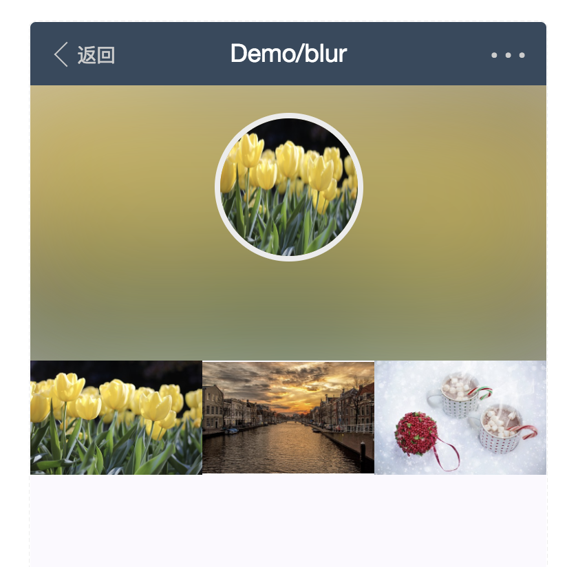

1.actionSheet 底部弹出选择条   

2.alert 弹出框 

3.badge 勋章  

4.blur 图片模糊阴影    

5.buttonTab 按钮组 

6.calendar 底部弹出日期组件

7.card 卡片 这个只是个卡片的布局组件

8.cell 一个带有padding的flex容器

9.cellBox

10.cellFormPreview

11.cell 单列的布局

12.checkIcon 选择框（单个）

13.checkList 选择框（多个）纵向

14.checker 选择框 （多个）横向

15.clocker 日期选择

16.colorPicker

17.countdown 倒计时

18.countup 数值跳动上升

19.DatetimeRange 适用于范围不大的选择

20.Divider 分割线

21.drawer 

22.Flexbox 

23.flow 进度条 （流程形式）

24.FormPreview 表单填写后的信息展示

25.grid 网格

26.group 带有mt的容器

27.Icon 图标

28.InlineCalendar 日历组件

29.InlineLoading 加载

30.InlineXNumber 数字获取

31.LoadMore 加载更多

32.Marquee 滚动条

33.Masker 背景块

34.Msg 提示信息展示页面

35.Panel 图文显示列表项

36.Picker 选择

37.Popover 提示

38.Popup底部弹出内容

39.PopupRadio底部弹出选择式单选

40.PopupPicker 底部弹出滚动式单选

41.Previewer

42.Qrcode 二维码

43.Radio 单选

44.Range 范围选择 横向范围拖动

45.Rater 百分比的图形表现形式（图形是字体符号）

46.Scroller 滚动区域和滚动加载
	
47.Search 

48.Selector 接近与原生的select

49.Spinner 加载动效

50.Step 进度 （步骤形式）

51.Sticky 滚动后固定在顶部

52.Swipeout 滑动显示更多的操作类似qq列表中的操作

53.Swiper

54.Tab

55.Tabbar 底部切换控件

56.Timeline 流程性的

57.Toast 轻量级的消息提示

58.ViewBox 

59.WechatEmotion 微信表情

60.XAddress 地址选择

61.XButton 按钮

62.XCircle 圆圈形式的进度

63.XDialog

64.XHeader 头部

65.XImg 一组图片

66.XInput 输入框组件 带验证

67.XNumber 数组输入组件

68.XProgress 一条进度条

69.XSwitch 开关

70.XTable 表格

71.XTextarea 输入域
