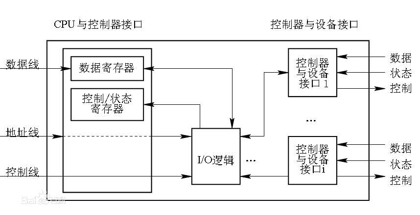
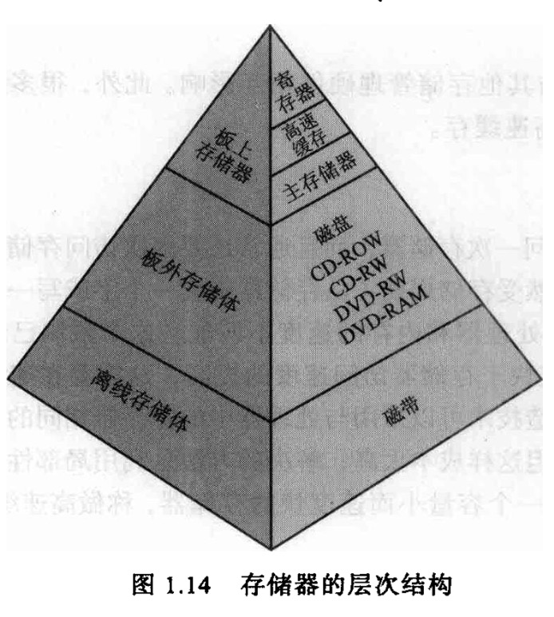
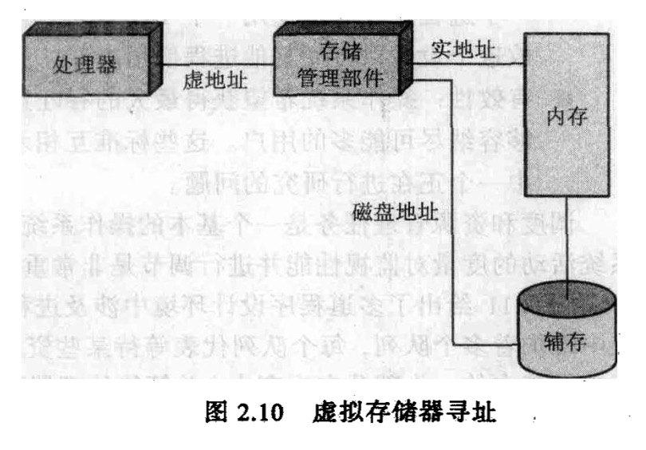
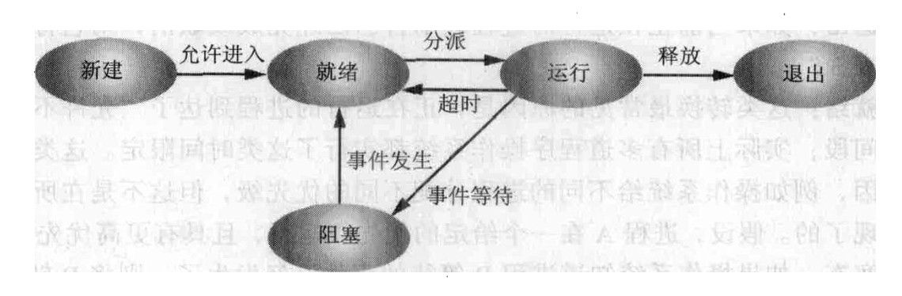
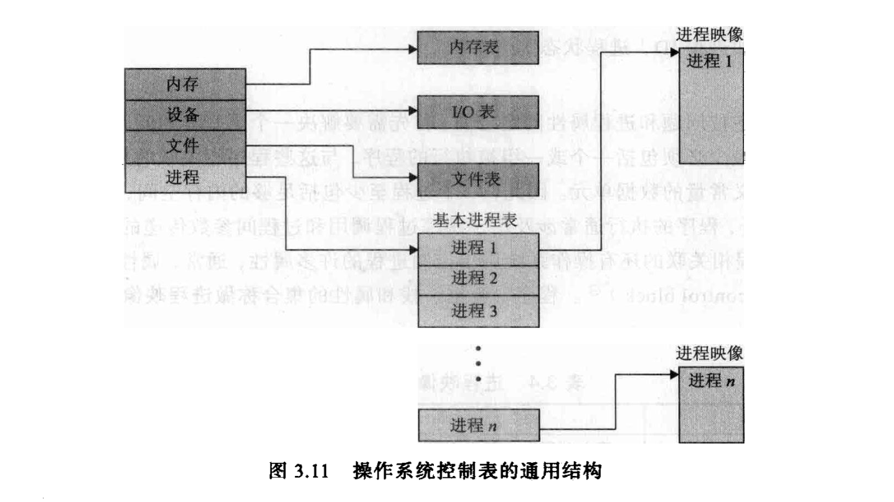
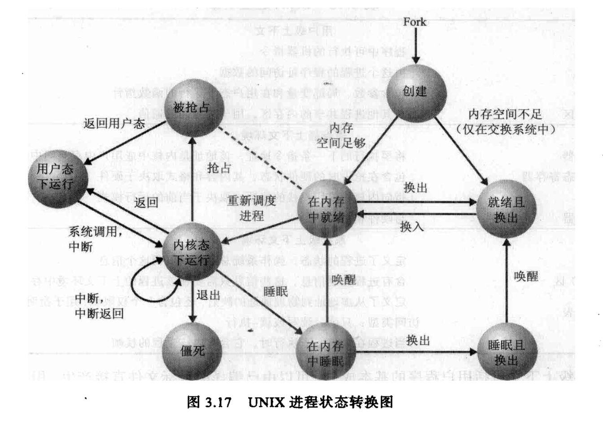

## 操作系统精髓和设计原理

### 计算机系统概述

#### 基本构成（p6）

1.处理器 
2.内存 
3.输入/输出模块 
4.系统总线

#### 处理器寄存器

1.用户可见寄存器
    + 数据寄存器
        * 累加器
    + 地址寄存器
        * 变址寄存器
        * 段指针
        * 栈指针

对于有些处理器，过程调用将导致所有用户可见的寄存器自动保存，在调用返回时，恢复保存的寄存器。

2.控制和状态寄存器
    + 程序计数器
    + 指令寄存器
    + 程序状态字
        * 条件码

程序状态字（PSW progress status word）是指一段包含被操作系统和潜在硬件使用的程序状态信息的内存或硬件区域。它经常包含一个指向下一条需要被执行指令的指针。程序状态字还通常包含一个错误状态区域和关于中断允许或禁止，超级或普通用户模式位的条件代码。

3.基本指令周期

在每个指令周期开始时，处理器从存储器中取一条指令。在典型的处理器中，程序计数器保存下一次要取的指令地址。除非有其他情况，处理器在每次取指令后总是递增PC，使得它能够按顺序取得下一条指令。取到的指令被放置在指令寄存器中。

所有指令和数据都是以16位的单元或者字来组织存储器。

指令对应对的操作分类：
    *处理器-存储器：数据可以从处理器传送到存储器，或者从存储器传送到处理器。
    *处理器-I/O：通过处理器和I/O模块间的数据传送，数据可以输出到外部设备，或者从外部设备输入数据。
    *数据处理：处理器可以执行很多与数据相关的算术操作或逻辑指令操作。
    *控制：某些指令可以改变执行顺序。

指令格式：指令格式包括操作码和地址码，操作数的地址，操作结果的存储地址和下一条指令的地址。指令格式则是指令字用二进制代码表示的结构形式，由操作码字段和地址码字段组成。

一般的操作数有被操作数、操作数及操作结果这三种数，因而就形成了三地址指令格式。

4.I/O函数

在某些情况下，允许I/O模块直接与内存发生数据交换，这个操作称为直接内存存取。

5.中断（p12描述要学会）

计算机提供其他模块（存储器、I/O设备）中断处理器正常处理过程的机制。

类别：

程序中断：
时钟中断：
I/O中断：
硬件故障中断：

从用户的角度看中断打断了正常执行的序列。当中断处理完成后，再恢复执行。

**时钟中断**

6.设备控制器
设备控制器是计算机中的一个实体，其主要职责是控制一个或多个I/O设备，以实现I/O设备和计算机之间的数据交换。它是CPU与I/O设备之间的接口，它接收从CPU发来的命令，并去控制I/O设备工作，以使处理机从繁杂的设备控制事务中解脱出来。

7.存储器的层次结构

存储器的设计目标：容量，存取速度，价格的权衡。
不依赖于单一的存储组件或技术，而是使用存储器的层次结构。（在不同的场景下运用不同的存储器，）

1.每一个“位”的价格递减
2.容量递增
3.存取时间递增
4.处理器访问存储器的频率递减

 内存是计算机中主要的内部存储器系统。内存中的每个单元位置都有一个唯一的地址对应。高速缓存对处理器不可见。高速缓存用于在内存和处理器的寄存器之间分段移动数据，以提高数据访问的性能。

 一部分内存可以作为缓冲区，用于临时保存从磁盘中读取的数据，有时称为磁盘高速缓存。（P19）

局部性原理是指CPU访问存储器时，无论是存取指令还是存取数据，所访问的存储单元都趋于聚集在一个较小的连续区域中。
    
+ 时间局部性（Temporal Locality）：如果一个信息项正在被访问，那么在近期它很可能还会被再次访问。
程序循环、堆栈等是产生时间局部性的原因。
+ 空间局部性（Spatial Locality）：在最近的将来将用到的信息很可能与现在正在使用的信息在空间地址上是临近的。
+ 顺序局部性（Order Locality）：在典型程序中，除转移类指令外，大部分指令是顺序进行的。顺序执行和非顺序执行的比例大致是5:1。此外，对大型数组访问也是顺序的。

高速缓存设计要点
高速缓存大小，块大小、映射函数、替换算法、写策略。

!(高速缓存)[./img/fast-cache.jpg]
总线

数据总线（Data Bus）：在CPU与RAM之间来回传送需要处理或是需要储存的数据。
地址总线（Address Bus）：用来指定在RAM（Random Access Memory）之中储存的数据的地址。
控制总线（Control Bus）：将微处理器控制单元（Control Unit）的信号，传送到周边设备，一般常见的为 USB Bus和1394 Bus。
扩展总线（Expansion Bus）：可连接扩展槽和电脑。
局部总线（Local Bus）：取代更高速数据传输的扩展总线。

8.I/O通信技术

可编程I/O、中断驱动I/O、直接内存存取

可编程I/O中I/O模块并不进一步通知处理器，尤其是它并不中断处理器。

9.栈

在内存中为栈保留一块连续的单元。正确操作需要三个地址，这些地址通常保存在处理器寄存器中。
栈指针、栈底、栈界限

10.过程调用和返回

当处理器执行一个调用时，它将返回地址放在栈中。目前常用的方式是使用栈帧为单元保存调用状态。
栈帧中包含函数中的局部变量、返回地址、前一帧指针

11.可重入过程 p32

## 操作系统概述

操作系统是控制应用程序执行的程序，并充当应用程序和计算机硬件之间的接口。

它有三个目标：
方便：操作系统使计算机更易于使用。
有效：操作系统允许以更有效的方式使用计算机系统资源。
扩展能力：在构造操作系统时，应该允许在不妨碍服务的前提下有效地开发、测试和引进新的系统功能。

操作系统为程序员屏蔽了硬件细节，并为程序员使用系统提供方便的接口。

作为用户/计算机接口的操作系统
操作系统访问服务：
    程序开发
    程序运行
    I/O设备访问
    文件访问控制
    系统访问
    错误检测和响应：操作系统都必须提供响应以清除错误条件，使其对正在运行的应用程序影响最小。

作为资源管理器的操作系统

一台计算机就是一组资源，这些资源用于对数据的移动、存储、处理，以及对这些功能的控制。而操作系统负责管理这些资源。

操作系统与普通的计算机软件作用相同，它也是由处理器执行的一段程序或一组程序。
操作系统通常会释放控制，而且必须依赖处理器才能恢复控制。

操作系统内核（kernel）

串行处理

简单批处理系统

多道程序设计批处理系统（产生竞争、相互干扰、数据共享等新问题）

分时系统（多个用户分享处理器时间）/实时事务处理系统

操作系统开发的5个重要理论：
1.进程
2.内存管理
3.信息保护和安全
4.调度和资源管理
5.系统结构

**进程**

描述：
一个正在执行的程序。
计算机中正在运行的程序的一个实例。
可以分配给处理器并由处理器执行的一个实例。
由单一的顺序的执行线程、一个当前状态和一组相关的系统资源所描述的活动单元。

进程可以看成由三部分组成：
1.一段可执行的程序
2.程序所需要的相关数据（变量、工作空间、缓冲区等）
3.程序的执行上下文（进程状态）上下文包括操作系统管理进程以及处理器正确执行进程所需要的所有信息。包括各种处理器寄存器，还包括操作系统使用的信息。

程序计数器和所有的数据引用相对于基址寄存器被解释，并且不能超过界限寄存器中的值。

**内存管理**

5个基本的存储器管理责任：
1.进程隔离：操作系统必须保护独立的进程，防止互相干涉各自的存储空间，包括数据和指令。
2.自动分配和管理：程序应该根据需要在存储层次间动态分配，分配对于程序员是透明的。
3.支持模块化程序设计。
4.保护和访问控制：不论在存储层次的哪一级，存储器的共享都会产生一个程序访问另一个程序存储空间的潜在可能。
5.长期存储：许多应用程序需要在计算机关机后长时间保存信息。（虚拟存储器和文件系统机制）
在分页系统中，进程由许多大小固定大小的块组成，这些块称作页。程序通过虚地址（virtual address）访问字，虚地址由页号和页中的偏移量组成。进程的每一页都可以放置在内存中的 **任何地方** 。分页系统提供了程序中使用的虚地址和内存中的实地址或者物理地址之间的动态映射。

可以通过给每个进程一个唯一的不重叠的虚拟存储空间来实现进程隔离，可以通过使两个虚拟存储空间的一部分重叠来实现内存共享。

**信息保护和安全**

可用性：保护系统不被打断
保密性：保证用户不能读到未授权访问的数据
数据完整性：保护数据不被未授权修改

**调度和资源管理**

公平性
有差别的响应性
有效性

**操作系统组织方式**

微内核体系结构、多线程、对称多处理、分布式操作系统、面向对象设计。

线程： 可分派的工作单元。它包括处理器上下文环境和栈中自己的数据区域。并且是可中断的，这样处理器可以转到另一个线程。

进程：一个或多个线程和相关系统资源的集合。

线程间来回切换所涉及的处理器开销要比在不同进程间进行切换要来的小。

对称多处理计算机

有多个处理器
这些处理器共享一个内存和I/O设备，它们之间通过通信总线或别的内部连接方案互相连接。
所有处理器可以执行相同的功能。

分布式操作系统使多机系统好像一个单一的内存空间、外存空间、和其他I/O模块。

**windows内核态组件**：（P54）
执行体：
内核：
硬件抽象层：
设备驱动：
窗口和图形系统：
I/O管理器：
高速缓存处理器：
对象管理器：
即插即用管理器：
电源管理器：
安全访问监控程序：
虚拟内存管理器：
进程/线程管理器：

**用户态进程**：
特殊系统进程：需进行管理系统的用户态服务
服务进程：
环境子系统：
用户应用进程：

windows子系统（p56？）

**客户/服务器模型**

windows操作系统服务、受保护子系统和应用程序都采用客户/服务器计算模型构造。环境子系统和windows用户态服务都是以进程的形式实现，通过RPC（Remote Procedure Call）与客户端进行通信。

线程和SMP

**windows对象**

Windows中的所有实体并非都是对象。当数据对用户态的访问是开放的，或者当数据访问是共享的或受限制的时都使用对象。对象表示的实体有文件、进程、线程、信号、计时器和窗口。

windows通过对象管理器以一致的方法创建和管理所有的对象类型。

执行体中的每个对象有时被称为内科对象，作为内核分配的内存块存在，并且只能被内核访问。当对象创建后，请求创建的应用程序得到该对象的句柄，句柄实质上是指向被引用对象的指针。

微内核管理的两类对象：（P58）
分派器对象：
控制对象：

**linux**

单体内核是指在一堆代码中实际上包含了所有操作系统功能，并作为一个单一的进程运行，具有唯一地址空间。
linux可加载模块有两个重要特征：
动态链接：
可堆栈模块：

在linux中进程和线程相同。

进程的表征（被放在进程控制块内）：

标识符
状态
优先级
程序计数器
内存地址
上下文数据
I/O状态信息
记账信息

CFS（完全公平调度器）

### 进程

进程状态：
运行态:
就绪态
阻塞态/等待态
新建态:操作系统所需要的关于该进程的信息保存在内存的进程表中，但进程自身还未进入内存，既是程序代码不在内存中，也没有为该程序相关的数据分配空间。
退出态

大多数系统基于现有的进程数或分配给现有进程的虚拟内存数量设置一些限制，以确保不会因为活跃进程的数量过多而导致系统的数量下降。

操作系统维护的4种不同类型的表：内存、I/O、文件、进程。

这些表以某种方式链接起来或交叉引用。

操作系统最初是如何知道创建表的？（P86）

当操作系统初始化后，它必须可以使用定义基本环境的某些配置数据，这些数据必须在操作系统之外，通过人的帮助或一些自动配置软件产生。

程序、数据、栈、属性（属性的集合称为进程控制块）的集合称作进程映像。
进程映像的一部分加载到内存中时，进程控制器加载过程是复制而非移动。

进程控制块信息(P87)
1.进程标识信息
2.处理器状态信息
3.进程控制信息

**进程控制**

系统态和用户态
系统态下：软件具有对处理器以及所有指令、寄存器、和内存的控制能力。

**进程创建**

1.给新进程分配一个唯一的进程标识符。
2.给进程分配空间。
3.初始化进程控制块。
4.设置正确的连接。
5.创建或者扩充其他数据结构。

**进程切换**

**模式切换**

1.把程序计数器置成中断处理程序的开始地址。
2.从用户态切换到内核态，使得中断处理代码可以包含有特权指令。

**安全问题**

操作系统关于每个进程都关联了一套权限。

**入侵检测**
入侵检测是一种安全服务，通过分监控和分析系统事件发现试图通过未经授权的方法访问系统资源的操作，并对这种操作提供实时或者准实时的警告。

**入侵检测系统（IDS）**

基于宿主的IDS
基于网络的IDS
感应器
分析器
用户界面

**认证**（零知识证明）

步骤：
1.确认步骤：对于安全系统，提出了标识符
2.验证步骤：提出或产生认证信息，用来证实在实体与标识符之间的绑定。

认证用户身份的方法：
个人知道的一些事物：

**访问控制**

访问控制实现了一种安全策略：指定谁或者何物可能有权使用特定的系统资源和每个场景下被允许的访问类型。

**防火墙**

对于保护本地系统或系统网络免于基于网络的安全威胁。防火墙提供了经过广域网和互联网对外部网络的访问。

**unix进程** 

进程状态：
1.用户运行
2.内核运行
3.就绪，并驻留在内存中
4.睡眠，并驻留在内存在
5.就绪被交换
6.睡眠被交换
7.被抢占
8.创建
9.僵死

进程描述：
1.用户级上下文
2.寄存器上下文环境
3.系统级上下文（包含操作系统管理进程所需要的其余信息，包括静态部分和动态部分）

unix有两个独特的进程。进程0是一个特殊的进程，是在系统启动时创建。实际上，这是预定义的一个数据结构，在启动时刻被加载，是交换进程。此外，进程0产生进程1，称作初始进程，进程1是系统中所有其他进程的祖先。

**进程控制**

unix中的进程创建是通过内核系统调用fork()实现。

